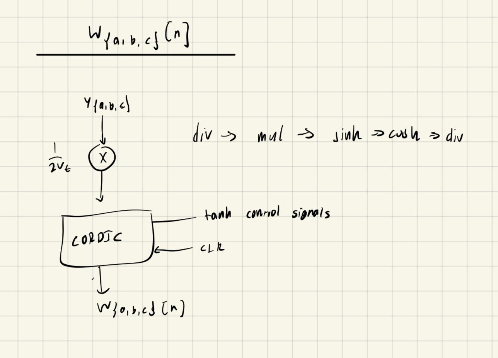
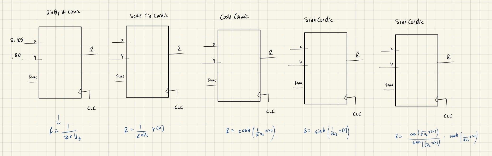

# Hardware303

Christian Miranda

I have implemented a partial replica of the Roland TB-303 in VHDL. The Roland
TB-303 is an analog bass line synthesizer noted for its characteristic filter -
a diode ladder filter - that is hard to replicate in software. This design uses
a Moog ladder filter however, since it is much more well known, and does not
require significant analog analysis to replicate the sound of the TB-303 as a
diode ladder would.


## Theory of Operation

### Basic Blocks

The Roland TB-303 consists of the following blocks:
    - Oscillator: a voltage-controlled oscillator that creates a square or
                 sawtooth wave in the bass clef range.
    - Filter: a resonant low-pass filter meant to mimic the sound of a Moog ladder
              filter, but using diodes instead of BJTs for the active component of
              the filter.
    - Sequencer: a small bank of memory and logic that generates the frequencies to be
    produced by the oscillator.
    - VCA: a voltage controlled amplifier used to control the dynamics (volume before,      
    during, and after a note is played). The TB-303 has the controls of ADSR
    (attack, delay, sustain, and release).

Thus, the Hardware 303 should implement the digital equivalent of each of these blocks.
That is,

    - A numerically controlled oscillator that takes an integer and produces both a square
    and sawtooth wave of the desired frequency.
    - A Moog ladder filter that models the dynamics of the analog filter.
    - A sequencer that generates integers according to a user input pattern.
    - A NCA (numerically controlled amplifier) that prescales the output according
      to the desired settting.

<insert picture of ADSR here>
<insert picture of blocks>
<insert schematic of TB-303 ???>

In this project, an NCO and filter were implemented and tested in VHDL.

### NCO

An NCO capable of outputting a square and sawtooth wave essentially consists of
an adder, a comparator, and a few registers to accumualte the added value. The
input word is added each clock period, and if a sawtooth waveform is desired,
we just output the accumulated value. If a square wave output is desired, we
simply threshold the accumulated value according to our desired duty cycle. More
complex NCOs included phase control word inputs in addition to frequency control
inputs, allowing the user to shift the phase when desired. If a sine wave is
desired, a lookup table mapping an accumulated value to an output value can be
implemented.

The NCO was tested over the bass clef range by logging the output word at each
clock cycle to a text file. This text file was then analyzed with a Python
script, `verify_nco.py`. This generates both a time and frequency domain plot
for each output frequency. We also programmitically verify that besides just the
fundamental frequency being correct, the spectral contents of the waveform
are what we expect for a square and sawtooth wave. A perfect square wave will
contain only odd harmonics, while a sawtooth wave will include all harmonics.
The harmonics of both will decay at a rate of 6dB / octave. 

### Filter

A resonant low-pass filter is simply a low-pass filter that produces 
The filter is based on the Huovilainen's paper titled "NON-LINEAR DIGITAL
IMPLEMENTATION OF THE MOOG LADDER FILTER" [1], in which the author aproximates
the non-linearities of a Moog ladder filter, resulting in the following
input-output equations:


$$
\begin{aligned}
y_a(n) &= y_a(n-1) + \frac{I_{ctl}}{CF_s}\left(\tanh\left(\frac{x(n) - 4ry_d(n-1)}{2V_t}\right) - W_a(n-1)\right) \\[10pt]
y_b(n) &= y_b(n-1) + \frac{I_{ctl}}{CF_s}\left(W_a(n) - W_b(n-1)\right) \\[10pt]
y_c(n) &= y_c(n-1) + \frac{I_{ctl}}{CF_s}\left(W_b(n) - W_c(n-1)\right) \\[10pt]
y_d(n) &= y_d(n-1) + \frac{I_{ctl}}{CF_s}\left(W_c(n) - \tanh\left(\frac{y_d(n-1)}{2V_t}\right)\right) \\[10pt]
W_{\{a,b,c\}}(n) &= \tanh\left(\frac{y_{\{a,b,c\}}(n)}{2V_t}\right)
\end{aligned}
$$


where $x[n]$ is the output of NCO, and $y_d$ is the output of the filter. We naturally
see that this design lends itself to a multistage design, in which we can generically
define a filter stage, as well as a generic "W block" that computes  $W_{\{a,b,c\}}(n)$.

The W block can be represented as follows:



Pratically, we implement division and mulitplication with the CORDIC as well.
Aditionally, since the CORDIC can only calculate sinh, and cosh, we need a final
division step to calculate tanh. This can be done with the following arrangement
of CORDICs:




It is important to note that the finished design uses Q1.14 signed fixed point
numbers (or Q2.14 depending on the naming) convention. This means that we have
two bits for a signed integer part, and 14 bits for the fractional part. This
was done because the CORDIC was rigorously tested in this configuration, but
this severely limits range of intermediate values we can represent. Ideally,
we would be able to represent the voltage range of original TB-303, which is
most on the order of 10s of voltages.

Aditionally, the CORDIC was modified so that multiple instantiations of it
are possible, and was made fully synchronous to simplify prototyping. This
will severely limit speed, but since our timinig requirement is relatively large,
we are okay with this trade off.


The filter as a whole can be represented using the following diagram.

## Results
 
The NCO was shown to accurately produce the required notes in the bass clef.

<insert matplotlib pic here>

## Source Code structure

```
./
├── Dockerfile # dockerfile used for reproducible github build (doesn't work currently)
├── Makefile   # top level makefile (doesn't work currently)
├── README.md
├── TODO.md
├── build_osvvm.sh # osvvm build script
├── cordic/        # cordic directory. Note that this includes many versions of the cordic
|                  # also note that these versions are BROKEN (you can't instatiate multiple
|                  # of them because I have a shared variable bug in the CordicConstants package)
|
├── doc.md         # project documentation source code
├── doc.pdf        # project documentation PDF
├── filter/        # filter implementation. Includes all relevant files
│   ├── AddSub.vhd*             # 1-bit adder/subtracter
│   ├── AdderSubtracter.vhd*    # n-bit adder/subtracter
│   ├── AnsiEscape.vhd*         # AnsiEscape constants for colored output
│   ├── Cordic.vhd*             # 16-bit, Q1.14 (signed) fixed point cordic. Implemented internally
|   |                           # using Q3.18 signed fixed point numbers (22-bit). Modified to be
|   |                           # concurrent. Implemented using multiple stages
|   |
│   ├── CordicStage.vhd*        # A single Cordic stage
│   ├── FixedLib.vhd*           # Real to fixed point standard_logic_vector conversion and vice-versa
│   ├── Makefile                # filter make file
│   ├── MoogFilter.vhd          # Top level filter source file
│   ├── MoogFilterStage.vhd     # A single stage of the moog ladder filter
│   ├── MoogFilterStage_TB.vhd  # Test bench for single moog ladder filter stage
│   ├── MoogFilter_TB.vhd       # test bench for top level moog ladder filter
│   ├── WBlock.vhd              # W block source file (see above)
│   ├── WBlock_TB.vhd           # W block test bench
│   ├── make_filter.sh*         # shell script to build and run the filter
│   ├── make_stage.sh*          # shell script to build and run the filter stage test bench
│   ├── matlab/                 # matlab dev files
│   ├── moogfilterstage_conf.gtkw
│   ├── moogfilterstage_tb.vcd
│   ├── out.txt
│   ├── q1_14_filter.py*        # GTKwave filter to show fixed point numbers
│   └── work/
├── filter_diagram.jpg  
├── gcc-12.5.0/                 # GCC source code (for compiling GHDL 7.0.0 from source)
|
├── nco/
│   ├── INSTRUCTIONS.md         # build instructions
│   ├── Makefile*               # makefile
│   ├── nco.vhd*                # NCO source file
│   ├── nco_tb.vhd*             # NCO test bench
│   ├── out.txt                 # output words from test bench
│   ├── sawtooth.txt            # sawtooth only output words
│   ├── sawtooth_freq_domain/   # frequency domain plots
│   ├── sawtooth_time_domain/   # time domain plots
│   ├── square.txt              # square wave only output words
│   ├── square_freq_domain/     # frequency domain plots
│   ├── square_time_domain/     # time domain plots
│   ├── time_util.vhd           # ???
│   ├── verify_nco.py*          # iterations of python script used to verify NCO
│   ├── verify_nco.py.copy*
│   ├── verify_nco_1.py
│   ├── verify_nco_2.py
│   ├── verify_nco_3.py
├── sub.md                      # submission doc
├── w_block.jpg
└── w_block_digital.jpg
```

## Building

Ideally:

```
$ cd filter
$ ./make_filter.sh
```

but this will most likely not work for others because

1) I used GHDL 7.0.0 (compiled from source), which has breaking changes
   when compared to versions of GHDL packages with distros

2) My OSVVM build directory is hard coded there

I am working on getting it to build in github.

[1] https://dafx.de/paper-archive/2004/P_061.PDF
